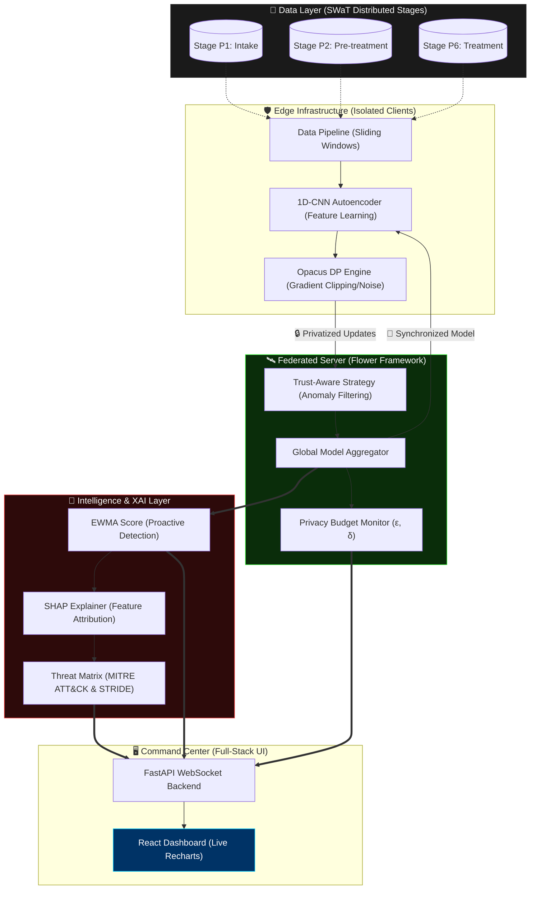

# CTMAS: Proactive Threat Modeling for Intelligent Cyber-Physical Systems

**🔗 Live demo:** [ctmas-dashboard.onrender.com](https://ctmas-dashboard.onrender.com) — replays one real recorded run (see [Deployment](#-deployment) for why); self-hosting via [Getting Started](#-getting-started) runs it live end-to-end.

## 🛡️ Project Philosophy
**CTMAS** (Cyber-Physical Threat Monitoring & Analysis System) is a production-grade framework designed to secure Industrial Control Systems (ICS)—specifically Water Treatment Plants—using a decentralized, privacy-preserving machine learning pipeline. 

Unlike reactive systems that trigger alerts *after* a sensor breaches a static limit, CTMAS utilizes **Proactive Threat Modeling**. It learns the "normal" behavioral fingerprint of an entire plant and detects minute statistical deviations (anomalies) that precede actual failure.

---

## 🏗️ System Architecture



---

---

## 🏗️ Detailed Architecture & Workflow

The system operates in four distinct phases, ensuring security at each layer of the stack:

1.  **Data Partitioning (Decentralized Preparation)**: Raw SWaT sensor data is mapped to its physical origin (Stages P1–P6). This reflects a real-world edge computing scenario where stage controllers don't share raw data.
2.  **Federated Learning with Differential Privacy**: Nodes ship weight updates, not data. Every update is "privatized" by injecting noise, ensuring an attacker cannot reverse-engineer the plant's state from the model.
3.  **Proactive Detection (EWMA)**: An Early Warning System monitors Error reconstruction trends. If the trend exceeds a dynamic threshold, an intercept is triggered.
4.  **Intelligence Synthesis (XAI & Mapping)**: SHAP explains *which* sensor is failing, and the Threat Matrix translates that into **MITRE ATT&CK** techniques and **STRIDE** categories.

---

## 📂 Module-by-Module Analysis

### 1. `models.py`: The Neural Architect
*   **Technology**: PyTorch 1D-CNN Autoencoder.
*   **Mechanism**: A symmetric encoder-decoder that compresses time-series windows into a latent space and attempts to reconstruct them.
*   **The "Why" (CNN vs RNN)**: Standard Recurrent Neural Networks (LSTMs) are notoriously difficult to use with **Differential Privacy (DP)** because they maintain hidden states across time, making per-sample gradient computation (a requirement for Opacus) mathematically complex. We use **1D-CNNs** because they capture temporal trends via convolutional filters while remaining perfectly compatible with DP engines.

### 2. `data_pipeline.py`: Time-Series Engineering
*   **Technology**: Pandas, NumPy, Scikit-Learn.
*   **Mechanism**: Implements **Sliding Window Tokenization**. It takes raw sensor logs and creates 3D tensors `(Batch, Sequence_Length, Features)`. 
*   **Key Detail**: Features are zero-padded to `Config.NUM_FEATURES`. This ensures that even if Stage P1 has fewer sensors than P6, the neural architecture remains globally symmetric across the federated network.

### 3. `local_training.py`: The Privacy Engine
*   **Technology**: **Opacus** (by Meta).
*   **Mechanism**: Before gradients are sent to the server, this module:
    1.  Computes per-sample gradients.
    2.  Clips the gradients to a rigid norm (`MAX_GRAD_NORM`).
    3.  Adds Gaussian noise.
*   **The "Why"**: This provides a mathematical guarantee of **Differential Privacy**. It ensures that no single data pulse at the edge can be uniquely identified in the global global model.

### 4. `server.py`: Trust-Aware Aggregation
*   **Technology**: Flower (`flwr`).
*   **Mechanism**: Extends the standard `FedAvg` (Federated Averaging) strategy. It calculates the similarity of local updates.
*   **Poisoning Defense**: If a node is compromised and starts sending "junk" updates to poison the global model, the `TrustAware` logic detects the anomaly and **excludes that node** from the round aggregation.

### 5. `threat_intelligence.py`: Early Warning & Intelligence
*   **Mechanism**: 
    - **EWMA (Exponential Weighted Moving Average)**: Tracks the *trend* of reconstruction errors. This is crucial for detecting "Low-and-Slow" attacks that stay just below static thresholds for days.
    - **Intelligence Mapping**: A static knowledge base that maps sensor prefixes (e.g., `LIT`, `FIT`) to **STRIDE** and **MITRE ATT&CK for ICS** T-codes.
*   **Benefit**: Converts raw math into actionable "Combat Reports" for security operators.

### 6. `xai_explainer.py`: The Black-Box Unpacker
*   **Technology**: **SHAP** (SHapley Additive exPlanations).
*   **Mechanism**: Uses `GradientExplainer` to attribute the model's reconstruction error to specific input sensors.
*   **Outcome**: When an alert fires, SHAP tells you precisely which sensor (e.g., `AIT201`) is being spoofed.

---

## 📡 Full-Stack Visualization Layer

### `api.py`: WebSocket Backend
*   **Technology**: FastAPI + WebSockets.
*   **The "Why"**: Standard REST APIs are insufficient for live simulations. We use WebSockets to "push" events (training rounds, sensor blips, XAI results) to the frontend with zero latency.

### `frontend/`: The Command Center
*   **Technology**: React, TailwindCSS, Recharts, Lucide Icons.
*   **Dashboard Components**:
    - **Intro panel**: Explains what the system does before a run starts, so a first-time visitor isn't dropped straight into an unlabelled dashboard.
    - **Swarm View**: Shows the training status of all 6 process stages in the federated network.
    - **Telemetry Panel**: Live graph of reconstruction error vs. early warning (EWMA) score.
    - **Intelligence Summary**: Displays the SHAP-attributed sensors and MITRE/STRIDE mapping once an anomaly is intercepted.
    - **Training Analytics**: Renders the Federated Learning loss/epsilon curve (`federated_metrics.png`).
    - **Recorded-demo disclosure**: When `VITE_DEMO_MODE=true` (the public demo), a visible badge and note make clear the run is a faithful replay, not a fresh per-visitor computation — see [Deployment](#-deployment).

---

## 🚀 Getting Started

### 📦 Prerequisites
- Python 3.9+
- Node.js & npm (for the Web Dashboard)

### 🛠️ Installation
```bash
# Backend
pip install -r requirements.txt

# Frontend
cd frontend
npm install
```

### 📊 Dataset

The real **SWaT** dataset is distributed by iTrust, Singapore University of Technology and Design, under a data-use agreement, and cannot be bundled with this repository. Pick one option:

**Option A — Synthetic (default, zero setup).** Generates a schema-compatible stand-in (same per-stage sensor/actuator tags, injected spike/drift/actuator-flip attacks) so the whole pipeline runs end-to-end without external access:
```bash
python scripts/generate_synthetic_dataset.py
```

**Option B — Real SWaT via Kaggle mirror.** A third-party mirror of the dataset exists on [Kaggle](https://www.kaggle.com/datasets/vishala28/swat-dataset-secure-water-treatment-system); this is *not* an official iTrust distribution, so check its license/terms before relying on it for anything beyond personal research (for the authoritative source, request access directly from [iTrust](https://itrust.sutd.edu.sg/itrust-labs_datasets/)).

- Automatic, needs your own Kaggle API credentials (`~/.kaggle/kaggle.json` or `KAGGLE_USERNAME`/`KAGGLE_KEY`):
  ```bash
  pip install -r requirements-kaggle.txt
  python scripts/download_kaggle_dataset.py
  ```
- Manual, no API token needed — click "Download" on the Kaggle page above, extract the zip, then:
  ```bash
  python scripts/download_kaggle_dataset.py --source-dir /path/to/extracted/folder
  ```

Either way, the result is `dataset/normal.csv` + `dataset/attack.csv` (git-ignored — sensor data, real or synthetic, is never committed). The pipeline auto-sizes its per-stage feature padding to whichever dataset is present, so the real dataset's larger/uneven sensor counts per stage are never silently truncated.

### 🏃 Running
- **Mode 1 (CLI)**: `python main.py`
- **Mode 2 (Web Dashboard, live)**:
  1. Start backend: `python api.py`
  2. Start frontend: `cd frontend && npm run dev`
  3. Navigate to `http://localhost:5173`
- **Mode 3 (Web Dashboard, recorded replay — no backend)**: set `VITE_DEMO_MODE=true` in `frontend/.env.local`, then `cd frontend && npm run dev`. Replays `frontend/public/demo_run.json` (regenerate it with `python scripts/record_demo_run.py` after a live run). This is what [the live demo](https://ctmas-dashboard.onrender.com) runs.

### ✅ Testing
```bash
pip install -r requirements-dev.txt
pytest -v
```
The suite covers stage-partitioning correctness (no cross-stage sensor leakage), model/Opacus compatibility, EWMA scoring, trust-aware aggregation (a poisoned client update is actually excluded), and SHAP attribution — generating the synthetic dataset automatically if it isn't already present.

CI (`.github/workflows/ci.yml`) runs this suite plus a frontend lint/build on every push and pull request against `main`.

---

## 🛠️ Technology Stack Summary

| Layer | Technology |
| :--- | :--- |
| **Computational Framework** | PyTorch / Python |
| **Distributed Training** | Flower (flwr) |
| **Privacy / Encryption** | Opacus (Differential Privacy) |
| **Explainable AI** | SHAP (Gradient Explainer) |
| **Web Service** | FastAPI / Uvicorn |
| **Web UI** | React / TailwindCSS / Recharts |
| **Threat Intelligence** | MITRE ATT&CK / STRIDE |

---

## 🚀 Deployment

The [live demo](https://ctmas-dashboard.onrender.com) is a static site (`ctmas-dashboard`, Render) with **no backend** — it replays a recorded real run (`frontend/public/demo_run.json`, generated by `scripts/record_demo_run.py`) with the same pacing the live WebSocket uses, via `VITE_DEMO_MODE=true`.

This wasn't the original plan. A `ctmas-api` backend service (FastAPI + Uvicorn, `python` runtime) was deployed first to run the real pipeline live per visitor — it built successfully but **crashed on startup with an out-of-memory error above 512MB**, before serving a single request: `torch` + `opacus` + `shap` + `pandas` + `scikit-learn` simply don't fit a free-tier instance just to import. The next Render tier with more RAM (Standard, 2GB) costs $25/month, which is disproportionate for a coursework demo link. Replaying one real, faithful run is the zero-cost alternative — the dashboard discloses this explicitly (the "Recorded demo" badge) rather than implying live computation it isn't doing.

**Self-hosting runs it live**, no replay involved — see [Running](#-running) Mode 2. If you do want a live public backend:
1. Deploy `api.py` as a Python web service (`buildCommand: pip install -r requirements.txt && python scripts/generate_synthetic_dataset.py`, `startCommand: uvicorn api:app --host 0.0.0.0 --port $PORT`) on an instance with **at least 2GB RAM**.
2. Deploy `frontend/` as a static site (`buildCommand: cd frontend && npm install && npm run build`, `publishPath: frontend/dist`) with `VITE_API_BASE_URL` set to the backend's URL (and leave `VITE_DEMO_MODE` unset).
3. Optionally set `ALLOWED_ORIGINS` on the backend to the frontend's URL (defaults to `*`, fine for a demo with no user data).

---

## ⚠️ Scope & Limitations

This project performs **model-driven proactive detection and post-detection threat labelling** — it does not perform a full Data-Flow-Diagram-based STRIDE exercise of the plant. Threats that don't manifest as a statistical deviation in reconstruction error (e.g. a purely network-layer attack that leaves physical process variables untouched) fall outside the current detection scope. The threat model also assumes the central aggregation server itself is not compromised and that a majority of federated clients are not compromised simultaneously.

## 🗺️ Roadmap

- [ ] Extend the STRIDE/MITRE rule table beyond sensor-prefix heuristics toward a learned or DFD-informed mapping
- [ ] Persist federated round history / alerts to a database instead of in-memory + PNG snapshots
- [ ] A live public backend (needs a $25/mo-class instance for the RAM — see [Deployment](#-deployment))
- [ ] Expand automated test coverage to the FastAPI WebSocket layer and the React dashboard

## 🤝 Contributing

Issues and pull requests are welcome. Please run `pytest -v` and `npm run lint && npm run build` (inside `frontend/`) before submitting a PR.

## 📄 License

Released under the [MIT License](LICENSE). Note this covers the CTMAS source code only — the SWaT dataset itself is distributed separately by iTrust, SUTD, under its own terms.

## 📬 Contact

Group 23, Department of Computer Science and Engineering, The LNM Institute of Information Technology, Jaipur — under the guidance of Dr. Ashish Kumar Dwivedi.
